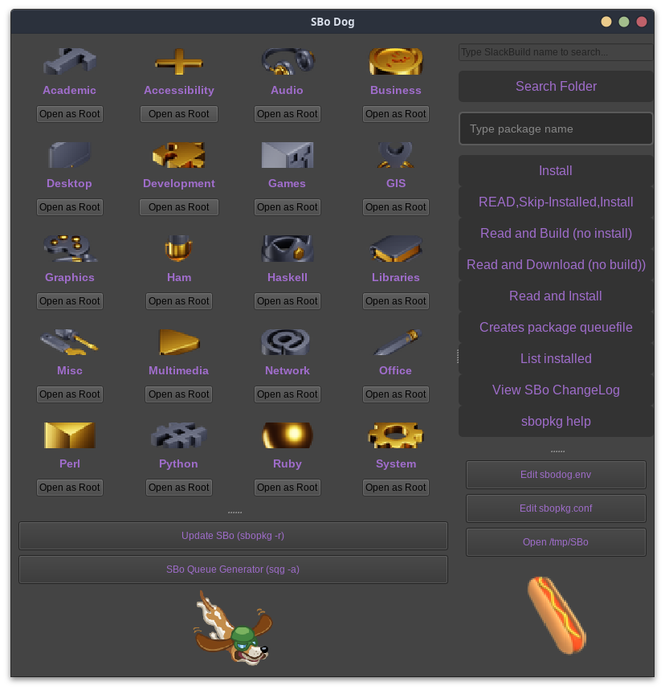

# SBoDog
*sbodog is a PyQt5  [sbopkg](https://sbopkg.org/) plugin. We can name it as sbopkg-gui...but thats not true.*<br>
*Reason for using sbodog is if you like a nice sbopkg gui when building SlackBuilds from [SlackBuilds.org](https://github.com/SlackBuildsOrg/slackbuilds.git) or [ponce](https://github.com/Ponce/slackbuilds) repositories*<br>
I wrote sbodog for fan after [eeel](https://github.com/rizitis/Eeel).


### Install
You can find a sbodog.SlackBuild (when it`ll be ready) [here](https://github.com/rizitis/One4All_SlackBuild/sbodog)


### Setup
By default app is ready and foccus for Slackware-stable and [SlackBuilds.org](https://github.com/SlackBuildsOrg/slackbuilds.git).<br>
If you are in Slackware-current and your *sbopkg*  rsync to [SBo-git](https://github.com/Ponce/slackbuilds)  then:
<br>open with your text editor `/etc/sbodog/sbodog.env` and comment `SLAKCBUILDS_REPO=SBo/15.0`<br>
It should be like this `# SLAKCBUILDS_REPO=SBo/15.0` <br>
Thats all.


### HowTo
As you know [sbopkg](https://sbopkg.org/) is a power terminal package manager for SBo.<br>
No gui plugin needed for old hackers, but if you like it be careful... <br>
That means you ran in Slackware a gui package manager in full root mode...<br>

### Thank very very much for icons:
[icon-icons.com](https://icon-icons.com)<br>
[freepik.com](https://www.freepik.com)<br>
[pngwing.com](https://www.pngwing.com/)<br>
[hiclipart.com](https://www.hiclipart.com/)<br>
[thenounproject.com](https://thenounproject.com/)<br>
[iconfinder.com](https://www.iconfinder.com/)<br>

### And Thanks 

```
Currently, the main sbopkg developers are:

    Willy Sudiarto Raharjo

Past (inactive) developers:

    Chess Griffin
    Mauro Giachero
    slakmagik

```

[](https://sbopkg.org/)


### Also many thanks
To all people maintain SlackBuilds and Slackbuilds.org.<br>

```
   _____ __           __                          
  / ___// /___ ______/ /___      ______ _________ 
  \__ \/ / __ `/ ___/ //_/ | /| / / __ `/ ___/ _ \
 ___/ / / /_/ / /__/ ,<  | |/ |/ / /_/ / /  /  __/
/____/_/\__,_/\___/_/|_| |__/|__/\__,_/_/   \___/ 
                                                  

```
<p>
  
Slackware™ is a [trademark](http://www.slackware.com/trademark/trademark.php) of Patrick Volkerding.
  
</p>

```
                            __              _______
  ___  _________ __      __/ /___________ _/ / ___/
 / _ \/ ___/ __ `/ | /| / / //_/ ___/ __ `/ /\__ \ 
/  __/ /  / /_/ /| |/ |/ / ,< / /__/ /_/ / /___/ / 
\___/_/   \__,_/ |__/|__/_/|_|\___/\__,_/_//____/  
                                                   

```
